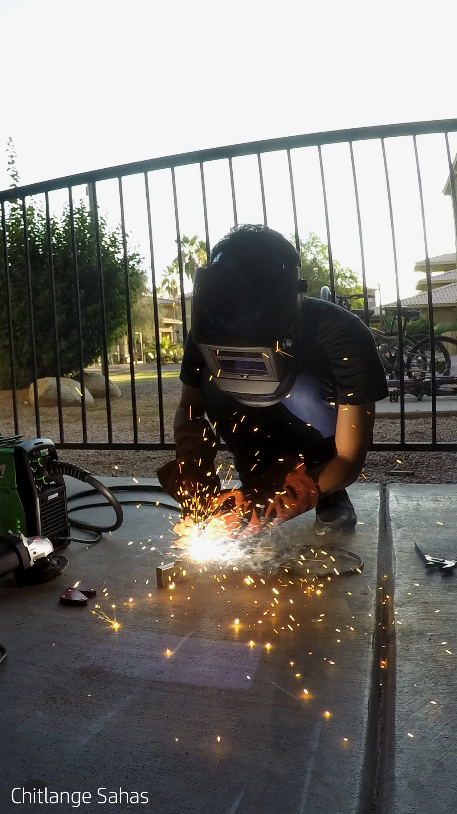

# UniWheel - A DIY self balancing mobility vehicle
*I built this project over 9 month time period, going from the ideation to the prototype.*

### Contains: 
* NodeMCU Controller Code (__C++__) 
* Android App Code repository (__Java__) : [link to the repository](https://github.com/ChitlangeSahas/UniWheel-Android-App) 
* CAD Files Inventor (__Inventor Professional 2019__)

### Media :
 * Video in action : [Watch Video](https://bit.ly/sahas-uniwheel)
 * CAD Render Model : 
 
    

      
      

 
### Some favorite captures :

   

